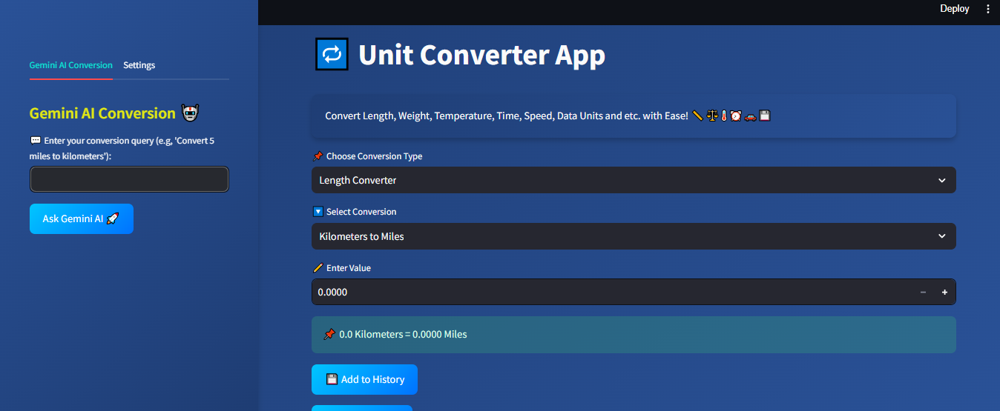

# Unit Converter App

🔁 **Unit Converter App** is a web application that allows users to convert various units of measurement with ease. The app leverages the power of Gemini AI to provide accurate and quick conversions.

## Features

- **Length Converter:** Convert Kilometers to Miles, Miles to Kilometers, Meters to Feet, Feet to Meters.
- **Weight Converter:** Convert Kilograms to Pounds, Pounds to Kilograms, Grams to Ounces, Ounces to Grams.
- **Temperature Converter:** Convert Celsius to Fahrenheit, Fahrenheit to Celsius.
- **Time Converter:** Convert Hours to Minutes, Minutes to Seconds, Seconds to Milliseconds, Milliseconds to Seconds.
- **Speed Converter:** Convert Kilometers per Hour to Miles per Hour, Miles per Hour to Kilometers per Hour.
- **Data Converter:** Convert Megabytes to Gigabytes, Gigabytes to Megabytes, Gigabytes to Terabytes, Terabytes to Gigabytes, Kilobytes to Megabytes, Megabytes to Kilobytes, Bytes to Kilobytes, Kilobytes to Bytes.

## Installation

1. Clone the repository:
    ```sh
    git clone https://github.com/Sheikh-Muhammad-Mujtaba/Unit-Converter.git
    cd unit-converter-app
    ```

2. Create a virtual environment and activate it:
    ```sh
    python -m venv venv
    .\venv\Scripts\activate  # On Windows
    source venv/bin/activate  # On macOS/Linux
    ```


3. Create a  file in the root directory and add your Gemini API key:
    ```env
    GEMINI_API_KEY=your_gemini_api_key
    ```

## Usage

1. Run the Streamlit app:
    ```sh
    streamlit run main.py
    ```

2. Open your web browser and navigate to `http://localhost:8501` to access the app.

## How to Use

1. Select the conversion type from the dropdown menu.
2. Enter the value you want to convert.
3. Select the specific conversion you need.
4. Click the "Ask Gemini AI 🚀" button to get the conversion result.
5. Optionally, add the result to your conversion history and clear the history when needed.

## Screenshots



## Contributing

Contributions are welcome! Please fork the repository and submit a pull request.

## License

This project is licensed under the MIT License. See the LICENSE file for details.

## Acknowledgements

- [Streamlit](https://streamlit.io/)
- [Gemini AI](https://gemini.ai/)

---

Convert Length, Weight, Temperature, Time, Speed, Data Units and more with ease! 📏⚖️🌡️⏰🚗💾