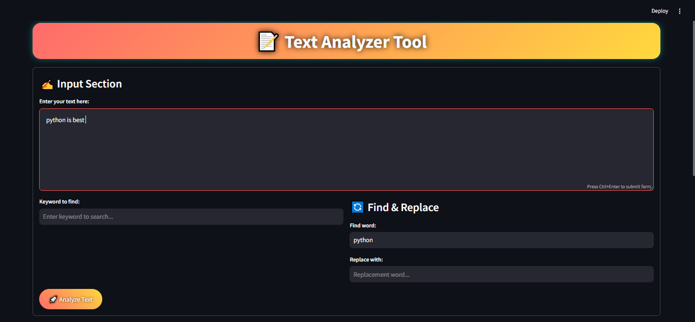
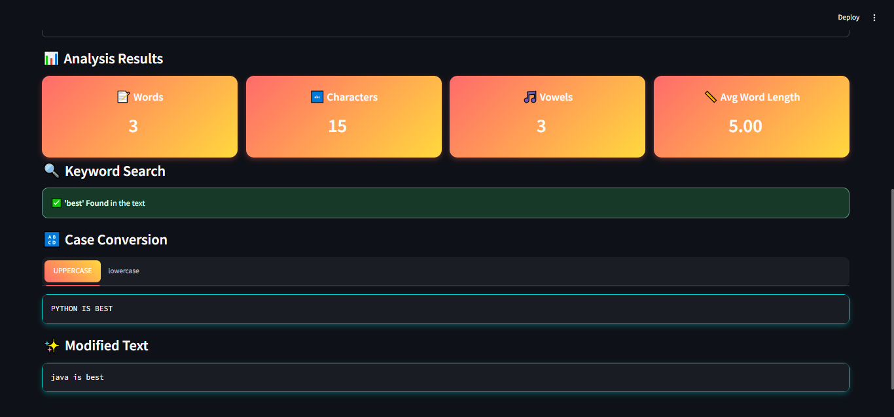

# Text Analyzer Tool 📝

**Text Analyzer Tool** is a Streamlit-based web application designed to analyze and manipulate text. It provides a user-friendly interface to perform various text analysis tasks, such as word count, character count, vowel count, keyword search, case conversion, and find-and-replace functionality.

---

## Features ✨

1. **Text Analysis**:
   - Word count
   - Character count
   - Vowel count
   - Average word length

2. **Keyword Search**:
   - Check if a specific keyword exists in the text.

3. **Case Conversion**:
   - Convert text to UPPERCASE or lowercase.

4. **Find and Replace**:
   - Replace specific words or phrases in the text.

5. **User-Friendly Interface**:
   - Clean and modern design with interactive elements.
   - Gradient backgrounds, hover effects, and shadows for a polished look.

---

## How to Use 🛠️

1. **Enter Text**:
   - Paste or type your text into the input box.

2. **Analyze Text**:
   - Click the **"Analyze Text"** button to view word count, character count, vowel count, and average word length.

3. **Keyword Search**:
   - Enter a keyword to check if it exists in the text.

4. **Case Conversion**:
   - Use the tabs to convert text to UPPERCASE or lowercase.

5. **Find and Replace**:
   - Enter a word to find and its replacement to modify the text.

---

## Installation and Setup 🚀

### Prerequisites
- Python 3.7 or higher
- Streamlit library

## Screenshots 📸

### Input Section

### Analysis Results

---

## Technologies Used 💻

- **Streamlit**: For building the web app interface.
- **Python**: For backend logic and text analysis.
- **CSS**: For custom styling and animations.
